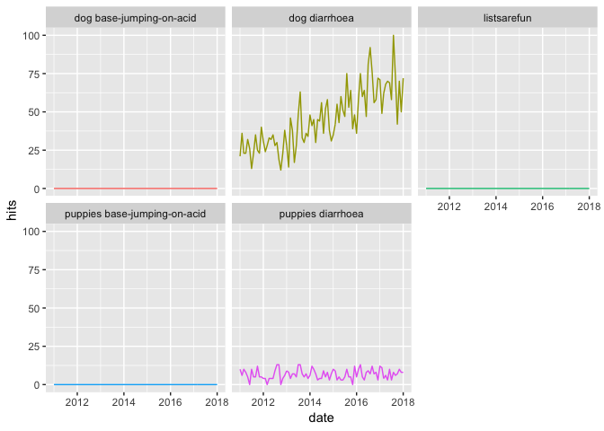

gtrends in list columns
================
Ian Handel
29/01/2019

``` r
library(tidyverse)
```

    ## ── Attaching packages ────────────────────────────────────────────────────────── tidyverse 1.2.1 ──

    ## ✔ ggplot2 3.1.0           ✔ purrr   0.2.5      
    ## ✔ tibble  2.0.99.9000     ✔ dplyr   0.7.8      
    ## ✔ tidyr   0.8.2           ✔ stringr 1.3.1      
    ## ✔ readr   1.3.1           ✔ forcats 0.3.0

    ## ── Conflicts ───────────────────────────────────────────────────────────── tidyverse_conflicts() ──
    ## ✖ dplyr::filter() masks stats::filter()
    ## ✖ dplyr::lag()    masks stats::lag()

``` r
library(gtrendsR)
library(fs) # for path_sanitise
library(lubridate) # for now()
```

    ## 
    ## Attaching package: 'lubridate'

    ## The following object is masked from 'package:base':
    ## 
    ##     date

### Build search table

``` r
# The signs to search for
signs <- c(
  "",
  "ill",
  "diarrhoea",
  "base-jumping-on-acid"
)

# The dog types to search for
dogs <- c(
  "puppy",
  "dog"
)

# All combinations of above (remove leading/trailing spaces)
searches <- tibble(dogs) %>%
  crossing(signs) %>%
  mutate(
    search = str_glue("{dogs} {signs}"),
    search = str_squish(search)
  )

head(searches)
```

    ## # A tibble: 6 x 3
    ##   dogs  signs                search                    
    ##   <chr> <chr>                <chr>                     
    ## 1 puppy ""                   puppy                     
    ## 2 puppy base-jumping-on-acid puppy base-jumping-on-acid
    ## 3 puppy diarrhoea            puppy diarrhoea           
    ## 4 puppy ill                  puppy ill                 
    ## 5 dog   ""                   dog                       
    ## 6 dog   base-jumping-on-acid dog base-jumping-on-acid

### For each search do a gtrends call

``` r
searches <- searches %>%
  mutate(gtrend = map(search, gtrends,
    geo = "GB",
    time = "2011-01-01 2018-01-01"
  ))

head(searches)
```

    ## # A tibble: 6 x 4
    ##   dogs  signs                search                     gtrend       
    ##   <chr> <chr>                <chr>                      <list>       
    ## 1 puppy ""                   puppy                      <S3: gtrends>
    ## 2 puppy base-jumping-on-acid puppy base-jumping-on-acid <S3: gtrends>
    ## 3 puppy diarrhoea            puppy diarrhoea            <S3: gtrends>
    ## 4 puppy ill                  puppy ill                  <S3: gtrends>
    ## 5 dog   ""                   dog                        <S3: gtrends>
    ## 6 dog   base-jumping-on-acid dog base-jumping-on-acid   <S3: gtrends>

### Extract some dataframes into their own columns

``` r
searches <- searches %>%
  mutate(
    iot = map(gtrend, "interest_over_time"),
    ibr = map(gtrend, "interest_by_region"),
    rt = map(gtrend, "related_topics")
  )

head(searches)
```

    ## # A tibble: 6 x 7
    ##   dogs  signs       search        gtrend   iot        ibr        rt        
    ##   <chr> <chr>       <chr>         <list>   <list>     <list>     <list>    
    ## 1 puppy ""          puppy         <S3: gt… <data.fra… <data.fra… <data.fra…
    ## 2 puppy base-jumpi… puppy base-j… <S3: gt… <NULL>     <data.fra… <NULL>    
    ## 3 puppy diarrhoea   puppy diarrh… <S3: gt… <data.fra… <data.fra… <data.fra…
    ## 4 puppy ill         puppy ill     <S3: gt… <data.fra… <data.fra… <data.fra…
    ## 5 dog   ""          dog           <S3: gt… <data.fra… <data.fra… <data.fra…
    ## 6 dog   base-jumpi… dog base-jum… <S3: gt… <NULL>     <data.fra… <NULL>

### make a safe filename and save

``` r
rds_path <- str_glue("gtrend_searches_{now()}.rds") %>%
  path_sanitize() %>%
  str_replace(" ", "_")

write_rds(searches, rds_path)
```

### Unnest, say iot, then try a plot

uses [this solution](https://stackoverflow.com/questions/47224831/using-tidyr-unnest-with-null-values) to deal with NULL dataframes

uses `right_join(searches %>% select_if(~!is_list(.)))` to include null search info

``` r
iot <- searches %>%
  filter(!map_lgl(iot, is.null)) %>% 
  unnest(iot) %>% 
  right_join(searches %>% select_if(~!is_list(.)))
```

    ## Joining, by = c("dogs", "signs", "search")

``` r
ggplot(iot) +
  aes(date, hits, colour = search) +
  geom_line() +
  facet_wrap(~search) +
  theme(legend.position = "none")
```

    ## Warning: Removed 2 rows containing missing values (geom_path).


